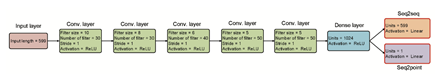
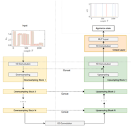

[](https://opensource.org/licenses/Apache-2.0)

<h1 align="center">전기 인프라 지능화를 위한 가전기기 전력 사용량 데이터</h1>

### 용어설명

1. 스마트그리드(Smart Grid) : 기존 전력망에 정보·통신기술을 접목하여, 공급자와 수요자간 양방향으로 실시간 정보 교환을 통해 지능형 수요관리, 신재생 에너지 연계 등을 가능케 하는 전력인프라 시스템

2. 비침습적 부하 모니터링(Non-Intrusive Load. Monitoring, NILM): 가정의 메인 분전반(단일 포인트)에서 측정되는 전력 신호 데이터를 가정에서 사용하는 개별 기기의 부하로 분해하는 기술이며, 기기의 상태 감지 및 식별, 전력 소비량의 추정 및 예측과 같은 다양한 과제(TASK)에 사용되는 기술

## 🤖 AI 모델 설명

### Seq2Point

- 기존 입력값과 출력값이 모두 윈도우 형태로 나왔던 seq2seq 방식을 개선하여, 윈도우의 중점만을 예측하도록 네트워크를 학습시킴.
- 한 지점만을 예측하기 때문에 출력 윈도우의 평균값으로 기기별 소비전력을 예측하던 seq2seq에 비해 정확도가 크게 개선되었음.
- 해당 모델은 최신 인공지능 기반 NILM 기술의 베이스라인에 해당하는 모델이며, 공통되는 벤치마크가 존재하지않아 정량적인 평가는 어려우나 기기별 유효전력 분해 Task에서 자주 사용되는 UK-DALE, REDD 데이터셋에서 현재까지도 가장 성능이 좋은 알고리즘임.
<p align="center">
  
  <br>
  <em>Seq2Point 모델 구조</em>
</p>

### UNET-NILM

- UNet은 2015년 computer vision 분야에서 생물학 이미지 segmentation을 위해 처음 제안되었으며, edge detection, sementic segmentation 등 2d 이미지에 국한되지 않는 입력 데이터의 유연성과 효율적인 학습이 가능한 구조로 인해 많은 연구 분야에서 사용됨.
- UNet은 CNN layer를 기반으로 이미지의 Context를 포착하기 위한 down-sampling 인코더와 지역화를 위한 up-sampling 디코더로 구성됨.
- UNet-NILM 모델은 전력 데이터를 다루기 위하여 기존 UNet의 2d CNN layer를 1d CNN으로 변경하고 기기의 활성, 비활성 상태 분류와 기기의 전력량을 동시에 추론할 수 있도록 적합한 손실함수를 도입한 모델이며, 머신러닝 및 단순 1d CNN을 활용한 모델에 비해 기기의 활성 비활성 상태 분류에서 높은 정확도를 달성하였음.
<p align="center">
  
  <br>
  <em>UNET-NILM 모델 구조</em>
</p>

# Quick Start

## 💿 모델 체크포인트

- Training, Evaluation 수행시 `ckp/seq2points/[기기번호]`와 `ckp/unet/[기기번호]`에 각 AI 모델 파일을 복사

## 🐳 Docker Setup

- 자세한 사항은 [설치 및 실행가이드](./tutorial.txt)를 참고해주십시오.

```bash
# 도커 이미지 빌드 커맨드
docker build -t aidata-nilm .

# 도커 컨테이너 실행 커맨드
docker run -dit --gpus all --ipc=host --name aidata-nilm -v [데이터셋경로]:[컨테이너내경로] aidata-nilm:latest

# 도커 컨테이너 진입 커맨드
docker attach aidata-nilm
```

## 🚀 Commands

```bash
# 데이터 전처리 커맨드
python main.py --data_dir [데이터셋경로] --output_dir [전처리결과경로] --parallel 0 --f prep

# 모델 추론 실행 커맨드
python main.py --data_dir [전처리결과 데이터셋경로] --labeling_dir [라벨링데이터경로] --output_dir [결과경로] --ckp_path_root [체크포인트경로] --f seq2points --fold ['train' OR 'eval']
python main.py --data_dir [전처리결과 데이터셋경로] --labeling_dir [라벨링데이터경로] --output_dir [결과경로] --ckp_path_root [체크포인트경로] --f unet --fold ['train' OR 'eval']
```

## 💬 Reference

- [Seq2Point-NILM](https://github.com/MingjunZhong/seq2point-nilm): Implmentation of Seq2Point model from Chaoyun Zhang, Mingjun Zhong, Zongzuo Wang, Nigel Goddard, and Charles Sutton. "Sequence-to-point learning with neural networks for nonintrusive load monitoring." Thirty-Second AAAI Conference on Artificial Intelligence (AAAI-18), Feb. 2-7, 2018.
- [UNETNiLM](https://github.com/sambaiga/UNETNiLM): Implementation of UNET-NILM model from Anthony Faustine, Lucas Pereira, Hafsa Bousbiat and Shridhar Kulkarni "UNet-NILM: A Deep Neural Network for Multi-tasks Appliances state detection and power estimation in NILM 5th International Workshop on Non-Intrusive Load Monitoring (NILM), (co-located with ACM BuildSys 2020 and jointly organized with the EU NILM Workshop)\*\*
- Kelly, J., & Knottenbelt, W. (2015). Neural NILM: Deep neural networks applied to energy disaggregation.
- Kelly, J., & Knottenbelt, W. (2015). The UK-DALE dataset, domestic appliance-level electricity demand and whole-house demand from five UK homes. Scientific Data, 2(1), 1-14.
- Kolter, J. Z., & Johnson, M. J. (2011). Redd: A public data set for energy disaggregation research. In Proceedings of the Workshop on Data Mining Applications in Sustainability (SIGKDD), Volume 25, San Diego, CA, pp. 59-62.
- Ronneberger, O., Fischer, P., & Brox, T. (2015). U-net: Convolutional networks for biomedical image segmentation. In Medical Image Computing and Computer-Assisted Intervention–MICCAI 2015: 18th International Conference, Munich, Germany, October 5-9, 2015, Proceedings, Part III (pp. 234-241). Springer International Publishing.

## 🪧 License

This project is licensed under the Apache License 2.0

<details>
<summary>see the details.</summary>

Apache License
Version 2.0, January 2004
http://www.apache.org/licenses/

TERMS AND CONDITIONS FOR USE, REPRODUCTION, AND DISTRIBUTION

1.  Definitions.

    "License" shall mean the terms and conditions for use, reproduction,
    and distribution as defined by Sections 1 through 9 of this document.

    "Licensor" shall mean the copyright owner or entity authorized by
    the copyright owner that is granting the License.

    "Legal Entity" shall mean the union of the acting entity and all
    other entities that control, are controlled by, or are under common
    control with that entity. For the purposes of this definition,
    "control" means (i) the power, direct or indirect, to cause the
    direction or management of such entity, whether by contract or
    otherwise, or (ii) ownership of fifty percent (50%) or more of the
    outstanding shares, or (iii) beneficial ownership of such entity.

    "You" (or "Your") shall mean an individual or Legal Entity
    exercising permissions granted by this License.

    "Source" form shall mean the preferred form for making modifications,
    including but not limited to software source code, documentation
    source, and configuration files.

    "Object" form shall mean any form resulting from mechanical
    transformation or translation of a Source form, including but
    not limited to compiled object code, generated documentation,
    and conversions to other media types.

    "Work" shall mean the work of authorship, whether in Source or
    Object form, made available under the License, as indicated by a
    copyright notice that is included in or attached to the work
    (an example is provided in the Appendix below).

    "Derivative Works" shall mean any work, whether in Source or Object
    form, that is based on (or derived from) the Work and for which the
    editorial revisions, annotations, elaborations, or other modifications
    represent, as a whole, an original work of authorship. For the purposes
    of this License, Derivative Works shall not include works that remain
    separable from, or merely link (or bind by name) to the interfaces of,
    the Work and Derivative Works thereof.

    "Contribution" shall mean any work of authorship, including
    the original version of the Work and any modifications or additions
    to that Work or Derivative Works thereof, that is intentionally
    submitted to Licensor for inclusion in the Work by the copyright owner
    or by an individual or Legal Entity authorized to submit on behalf of
    the copyright owner. For the purposes of this definition, "submitted"
    means any form of electronic, verbal, or written communication sent
    to the Licensor or its representatives, including but not limited to
    communication on electronic mailing lists, source code control systems,
    and issue tracking systems that are managed by, or on behalf of, the
    Licensor for the purpose of discussing and improving the Work, but
    excluding communication that is conspicuously marked or otherwise
    designated in writing by the copyright owner as "Not a Contribution."

    "Contributor" shall mean Licensor and any individual or Legal Entity
    on behalf of whom a Contribution has been received by Licensor and
    subsequently incorporated within the Work.

2.  Grant of Copyright License. Subject to the terms and conditions of
    this License, each Contributor hereby grants to You a perpetual,
    worldwide, non-exclusive, no-charge, royalty-free, irrevocable
    copyright license to reproduce, prepare Derivative Works of,
    publicly display, publicly perform, sublicense, and distribute the
    Work and such Derivative Works in Source or Object form.

3.  Grant of Patent License. Subject to the terms and conditions of
    this License, each Contributor hereby grants to You a perpetual,
    worldwide, non-exclusive, no-charge, royalty-free, irrevocable
    (except as stated in this section) patent license to make, have made,
    use, offer to sell, sell, import, and otherwise transfer the Work,
    where such license applies only to those patent claims licensable
    by such Contributor that are necessarily infringed by their
    Contribution(s) alone or by combination of their Contribution(s)
    with the Work to which such Contribution(s) was submitted. If You
    institute patent litigation against any entity (including a
    cross-claim or counterclaim in a lawsuit) alleging that the Work
    or a Contribution incorporated within the Work constitutes direct
    or contributory patent infringement, then any patent licenses
    granted to You under this License for that Work shall terminate
    as of the date such litigation is filed.

4.  Redistribution. You may reproduce and distribute copies of the
    Work or Derivative Works thereof in any medium, with or without
    modifications, and in Source or Object form, provided that You
    meet the following conditions:

    (a) You must give any other recipients of the Work or
    Derivative Works a copy of this License; and

    (b) You must cause any modified files to carry prominent notices
    stating that You changed the files; and

    (c) You must retain, in the Source form of any Derivative Works
    that You distribute, all copyright, patent, trademark, and
    attribution notices from the Source form of the Work,
    excluding those notices that do not pertain to any part of
    the Derivative Works; and

    (d) If the Work includes a "NOTICE" text file as part of its
    distribution, then any Derivative Works that You distribute must
    include a readable copy of the attribution notices contained
    within such NOTICE file, excluding those notices that do not
    pertain to any part of the Derivative Works, in at least one
    of the following places: within a NOTICE text file distributed
    as part of the Derivative Works; within the Source form or
    documentation, if provided along with the Derivative Works; or,
    within a display generated by the Derivative Works, if and
    wherever such third-party notices normally appear. The contents
    of the NOTICE file are for informational purposes only and
    do not modify the License. You may add Your own attribution
    notices within Derivative Works that You distribute, alongside
    or as an addendum to the NOTICE text from the Work, provided
    that such additional attribution notices cannot be construed
    as modifying the License.

    You may add Your own copyright statement to Your modifications and
    may provide additional or different license terms and conditions
    for use, reproduction, or distribution of Your modifications, or
    for any such Derivative Works as a whole, provided Your use,
    reproduction, and distribution of the Work otherwise complies with
    the conditions stated in this License.

5.  Submission of Contributions. Unless You explicitly state otherwise,
    any Contribution intentionally submitted for inclusion in the Work
    by You to the Licensor shall be under the terms and conditions of
    this License, without any additional terms or conditions.
    Notwithstanding the above, nothing herein shall supersede or modify
    the terms of any separate license agreement you may have executed
    with Licensor regarding such Contributions.

6.  Trademarks. This License does not grant permission to use the trade
    names, trademarks, service marks, or product names of the Licensor,
    except as required for reasonable and customary use in describing the
    origin of the Work and reproducing the content of the NOTICE file.

7.  Disclaimer of Warranty. Unless required by applicable law or
    agreed to in writing, Licensor provides the Work (and each
    Contributor provides its Contributions) on an "AS IS" BASIS,
    WITHOUT WARRANTIES OR CONDITIONS OF ANY KIND, either express or
    implied, including, without limitation, any warranties or conditions
    of TITLE, NON-INFRINGEMENT, MERCHANTABILITY, or FITNESS FOR A
    PARTICULAR PURPOSE. You are solely responsible for determining the
    appropriateness of using or redistributing the Work and assume any
    risks associated with Your exercise of permissions under this License.

8.  Limitation of Liability. In no event and under no legal theory,
    whether in tort (including negligence), contract, or otherwise,
    unless required by applicable law (such as deliberate and grossly
    negligent acts) or agreed to in writing, shall any Contributor be
    liable to You for damages, including any direct, indirect, special,
    incidental, or consequential damages of any character arising as a
    result of this License or out of the use or inability to use the
    Work (including but not limited to damages for loss of goodwill,
    work stoppage, computer failure or malfunction, or any and all
    other commercial damages or losses), even if such Contributor
    has been advised of the possibility of such damages.

9.  Accepting Warranty or Additional Liability. While redistributing
    the Work or Derivative Works thereof, You may choose to offer,
    and charge a fee for, acceptance of support, warranty, indemnity,
    or other liability obligations and/or rights consistent with this
    License. However, in accepting such obligations, You may act only
    on Your own behalf and on Your sole responsibility, not on behalf
    of any other Contributor, and only if You agree to indemnify,
    defend, and hold each Contributor harmless for any liability
    incurred by, or claims asserted against, such Contributor by reason
    of your accepting any such warranty or additional liability.

END OF TERMS AND CONDITIONS

© 2023 Insighter Corp. <contacts@insighter.co.kr>

Licensed under the Apache License, Version 2.0 (the "License");
you may not use this file except in compliance with the License.
You may obtain a copy of the License at

       http://www.apache.org/licenses/LICENSE-2.0

Unless required by applicable law or agreed to in writing, software
distributed under the License is distributed on an "AS IS" BASIS,
WITHOUT WARRANTIES OR CONDITIONS OF ANY KIND, either express or implied.
See the License for the specific language governing permissions and
limitations under the License.

</details>

---
